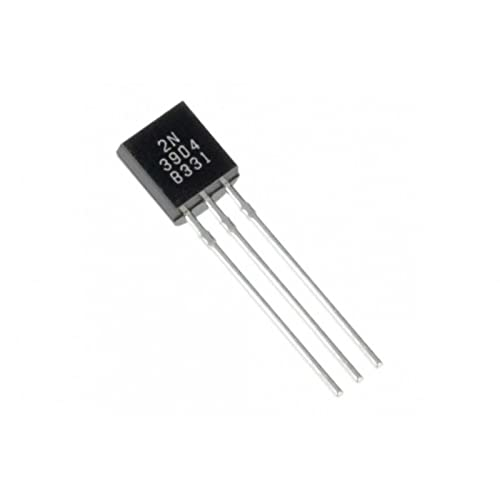

# **PanasonicIR**

An IR Remote built for Panasonic AC using ESP8266.

## **Introduction**

PanasonicIR is a project that can mimic an actual Panasonic AC remote. It is capable of changing temperature, vertical/horizontal wing speed, timer and other various parameters. It provides an easier cost effective solution that is better than any alternatives.

## **Components Required**

<table>
  <tr>
    <th><b>Name of the component</b></th>
    <th><b>Image</b></th>
  </tr>
  <tr>
    <td>ESP8266 Wifi Development Board</td>
    <td> </td>
  </tr> 
  <tr>
    <td>2N304 Transistor</td>
    <td></td>
  </tr>
  <tr>
    <td>Jumper Cables</td>
    <td></td>
  </tr>
  <tr>
    <td>940nm IR LED</td>
    <td></td>
  </tr>
  <tr>
    <td>SM0038 IR Reciever</td>
    <td></td>
  </tr>
  <tr>
    <td>Breadboard</td>
    <td></td>
  </tr>
</table>

## **Circuit Diagram and Connection**

To make the circuit connection for receiving IR signals, follow these circuit diagrams:
 
 

 

To make the circuit connection for sending IR signals, follow these circuit diagrams:
 
 
 

 

## **Pictures**

## **Usage**

To use PanasonicIR, follow these steps:

1. Head over to this repository and download their latest release: **`https://github.com/crankyoldgit/IRremoteESP8266.git`**.
2. Open Arduino IDE.
3. Go to Sketch > Include Library > Add .ZIP Library and select the downloaded lastest release ZIP file.
4. Clone this repository and open it in your Arduino IDE: **`https://github.com/Ablazesphere/PanasonicIR.git`**
5. Open the **`recieve_IR.ino`** file to check if the signals are being recieved by the SM0038 sensor.
6. Open the **`AC_Control.ino`** file to transmit the signals to the Panasonic AC.

## **Contributing**

If you'd like to contribute to PanasonicIR, here are some guidelines:

1. Fork the repository.
2. Create a new branch for your changes.
3. Make your changes.
4. Write tests to cover your changes.
5. Run the tests to ensure they pass.
6. Commit your changes.
7. Push your changes to your forked repository.
8. Submit a pull request.

## **References**

- **[crankyoldgit](https://github.com/crankyoldgit/IRremoteESP8266.git)**

